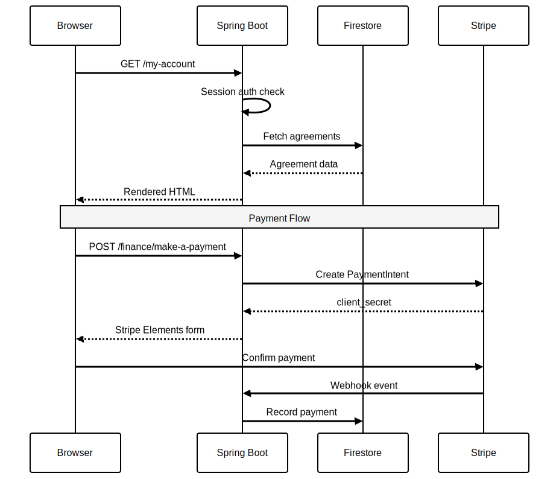

# Azadi Financial Services -- Customer Portal

Online finance portal for Azadi, an imaginary luxury car manufacturer. Lets customers view agreements, settle payments,
retrieve documents, and keep contact details up to date, all in one place.

Built on Spring Boot 3.4 with Thymeleaf server-side rendering. Firestore (Datastore mode) for persistence, Stripe for
card payments, GraalVM native-image for fast cold starts. Deployed to Cloud Run behind Firebase Hosting.
---

## Table of Contents

- [Architecture Overview](#architecture-overview)
- [Project Structure](#project-structure)
- [Development Setup](#development-setup)
- [Building and Testing](#building-and-testing)
- [Deployment](#deployment)
- [Environment Variables](#environment-variables)
- [Design Decisions](#design-decisions)

---

## Architecture Overview


### Request Flow

1. **Browser** hits Firebase Hosting (CDN for static assets, rewrites for HTML routes)
2. **Firebase Hosting** proxies HTML routes to **Cloud Run** (Spring Boot)
3. **Spring Security** validates session (DOB + postcode + agreement number auth)
4. **Thymeleaf** renders the page, fetching data from **Firestore** (Datastore mode)
5. **Stripe** handles card payments via Elements (client-side) + webhook (server-side)
6. **Resend** sends transactional emails (payment confirmations, alerts)



### Pages

| Route                          | Controller            | Description                                 |
|--------------------------------|-----------------------|---------------------------------------------|
| `/login`                       | AuthController        | DOB + postcode + agreement number login     |
| `/my-account`                  | AgreementController   | Account & payment details (accordion cards) |
| `/my-documents`                | DocumentController    | Document list with download                 |
| `/my-contact-details`          | ContactController     | Inline-editable address, phone, email       |
| `/finance/make-a-payment`      | PaymentController     | Stripe Elements card payment                |
| `/finance/settlement-figure`   | SettlementController  | Settlement quote + SMS delivery             |
| `/finance/change-payment-date` | StatementController   | DD date change request                      |
| `/finance/request-a-statement` | StatementController   | Statement request                           |
| `/finance/update-bank-details` | BankDetailsController | Encrypted bank detail update                |
| `/help/faqs`                   | HelpController        | FAQ accordion                               |
| `/help/ways-to-pay`            | HelpController        | Payment methods                             |
| `/help/contact-us`             | HelpController        | Contact information                         |

---

## Project Structure

```
azadi/
+-- src/main/java/com/azadi/
|   +-- agreement/          # Account details, agreement data
|   +-- auth/               # Login, session auth, customer entity
|   +-- audit/              # Audit trail logging
|   +-- bank/               # Bank details (AES-encrypted)
|   +-- common/             # Input sanitizer, validators, error handling
|   +-- config/             # Security, CSP, Stripe, Vite HMR, WebConfig
|   +-- contact/            # Contact details management
|   +-- document/           # Document storage + download
|   +-- email/              # Resend integration + branded templates
|   +-- help/               # Static help pages
|   +-- payment/            # Stripe payment + webhook handler
|   +-- seed/               # Dev data seeder (Firestore emulator)
|   +-- settlement/         # Settlement figure calculation
|   +-- statement/          # Statement requests
+-- src/main/resources/
|   +-- templates/          # Thymeleaf (layout.html + fragments + pages)
|   +-- application.yml     # Base config
|   +-- application-dev.yml # Dev profile (Vite HMR, emulator, seed data)
+-- frontend/
|   +-- src/
|   |   +-- css/            # PostCSS (layers: settings, generic, elements,
|   |   |                   #   objects, components, utilities)
|   |   +-- js/             # Vanilla JS (mobile menu, inline edit, Stripe)
|   |   +-- img/            # Static images
|   +-- vite.config.js      # Build config + dev server (port 5173)
|   +-- package.json
+-- compose.yml             # Firestore emulator (Docker)
+-- Dockerfile              # Multi-stage: JVM + GraalVM native targets
+-- .devcontainer/          # Dev container (Java 21, Node 22, Firebase CLI)
+-- e2e/                    # Playwright branding tests
+-- diagrams/               # Architecture diagrams (Mermaid -> SVG)
```

### Vertical Slice Architecture

Each feature is a self-contained package (controller, service, repository, DTOs). No shared base classes, no deep inheritance. Cross-cutting concerns (auth, audit, sanitization) live in `common/` and `config/`.

---

## Development Setup

### Prerequisites

- Docker and Docker Compose
- VS Code with Dev Containers extension (recommended)

### Quick Start (Dev Container)

```bash
git clone <repo-url> && cd azadi
code .
# VS Code prompts: "Reopen in Container" -> click it
```

The dev container provides Java 21, Node 22, Maven, Firebase CLI, and all dependencies pre-installed.

### Local Development Workflow


Open three terminals:

```bash
devcontainer up --workspace-folder .

# Terminal 1: Firestore emulator
devcontainer exec --workspace-folder . zsh -ic fb-emulator

# Terminal 2: Vite dev server (CSS/JS with HMR)
devcontainer exec --workspace-folder . zsh -ic dev-frontend

# Terminal 3: Spring Boot (Thymeleaf + API)
devcontainer exec --workspace-folder . zsh -ic dev

# Claude Code
devcontainer exec --workspace-folder . zsh -ic claude --dangerously-skip-permissions
```

Or without the shell aliases:

```bash
# Terminal 1
devcontainer exec --workspace-folder . gcloud emulators firestore start --host-port=0.0.0.0:8081 --database-mode=datastore-mode --project=demo-azadi

# Terminal 2
devcontainer exec --workspace-folder . bash -c "cd /workspace/frontend && npm run dev"

# Terminal 3
devcontainer exec --workspace-folder . bash -c "cd /workspace && set -a && source local.env && set +a && FIRESTORE_EMULATOR_HOST=localhost:8081 ./mvnw spring-boot:run -Dspring-boot.run.profiles=dev \"-Dspring-boot.run.jvmArguments=--add-opens java.base/java.math=ALL-UNNAMED\" -P no-checks"
```

`local.env` contains test Stripe keys and encryption secrets needed to start the app. The `dev` alias sources it automatically.

Open **http://localhost:8080**. Login with any seeded customer (e.g. DOB `15/3/1985`, postcode `SW1A 1AA`, agreement `AGR-100001`).

### How It Works

- **Thymeleaf** renders HTML at `:8080`, referencing CSS/JS from Vite at `:5173`
- **Vite HMR**: edit a `.css` file and changes appear instantly (no page reload)
- **DevTools**: edit a `.html` template or `.java` file and Spring auto-restarts (~1-2s)
- **No mock server**: Thymeleaf is the single template engine. No Nunjucks duplication.

### Seed Data (for frontend developers)

All test data lives in a single JSON file:

```
src/main/resources/seed/customers.json
```

When Spring Boot starts with the `dev` profile, it reads this file and populates the Firestore emulator automatically. No Java knowledge required to change the data -- edit the JSON, restart Spring Boot, and the new data appears.

**Adding a customer**: copy an existing entry in the array, change the fields. **Changing a balance or vehicle model**: find the customer, edit the value. **Adding a document**: append to the customer's `documents` array.

Each customer entry contains everything needed to render every page:

```json
{
  "customerId": "CUST-001",
  "fullName": "James Wilson",
  "dob": "1985-03-15",
  "postcode": "SW1A 1AA",
  "agreement": {
    "agreementNumber": "AGR-100001",
    "vehicleModel": "AZADI SUMMIT V8 TOURING",
    "balancePence": 6499960,
    "monthlyPaymentPence": 132652,
    "..."
  },
  "documents": [
    { "title": "Finance Agreement", "fileName": "finance-agreement.pdf", "..." }
  ]
}
```

To re-seed after editing: stop Spring Boot, kill the emulator (Ctrl+C in terminal 1), restart it (`fb-emulator`), then restart Spring Boot (`dev`). The emulator holds data in memory, so restarting it gives you a clean slate.

### Seeded Test Customers

| Customer       | DOB       | Postcode | Agreement  | Vehicle            |
|----------------|-----------|----------|------------|--------------------|
| James Wilson   | 15/3/1985 | SW1A 1AA | AGR-100001 | SUMMIT V8 TOURING  |
| Sarah Thompson | 22/7/1990 | M1 1AE   | AGR-100002 | EXPLORER SPORT     |
| David Patel    | 3/11/1978 | B1 1BB   | AGR-100003 | VANGUARD HSE       |
| Emma Roberts   | 28/1/1992 | LS1 1BA  | AGR-100004 | PIONEER SE         |
| Michael Chen   | 10/6/1988 | EH1 1YZ  | AGR-100005 | MERIDIAN R-DYNAMIC |

---

## Building and Testing

### Build

```bash
# Frontend only (CSS/JS)
cd frontend && npm run build

# Backend only (skip quality gates)
./mvnw compile -P no-checks

# Production JAR (frontend + backend)
./mvnw package -P no-checks,frontend -DskipTests

# GraalVM native image
./mvnw -Pnative native:compile -DskipTests
```

### Test

```bash
# Unit tests (73 tests)
./mvnw test -P no-checks

# All tests including integration (requires Docker for Firestore)
./mvnw verify -P no-checks

# Frontend lint
cd frontend && npm run lint && npm run format:check

# Playwright branding tests
npx playwright test
```

### Quality Gates

| Tool       | Scope                                     |
|------------|-------------------------------------------|
| Checkstyle | Code style (Google conventions)           |
| PMD        | Static analysis                           |
| SpotBugs   | Bug detection (Max effort, Low threshold) |
| JaCoCo     | Code coverage                             |
| ESLint     | JavaScript linting                        |
| Prettier   | CSS/JS formatting                         |

Run all gates: `./mvnw verify`

---

## Deployment

### Docker (JVM)

```bash
docker build --target jvm -t azadi .
docker run -p 8080:8080 --env-file local.env azadi
```

### Docker (GraalVM Native)

```bash
docker build --target native -t azadi-native .
docker run -p 8080:8080 --env-file local.env azadi-native
```

---

## Environment Variables

| Variable                      | Default        | Description                                |
|-------------------------------|----------------|--------------------------------------------|
| `GCP_PROJECT_ID`              | `test-project` | GCP project ID                             |
| `FIRESTORE_DB`                | `azadi`        | Firestore database name                    |
| `FIRESTORE_EMULATOR_HOST`     | (none)         | Set to `localhost:8081` for local dev      |
| `STRIPE_API_KEY`              | (none)         | Stripe secret key                          |
| `STRIPE_WEBHOOK_SECRET`       | (none)         | Stripe webhook signing secret              |
| `VITE_STRIPE_PUBLISHABLE_KEY` | (none)         | Stripe publishable key (client-side)       |
| `RESEND_API_KEY`              | (none)         | Resend email API key                       |
| `AZADI_ENCRYPTION_KEY`        | (none)         | 32-char AES key for bank detail encryption |
| `AZADI_ENCRYPTION_SALT`       | (none)         | Salt for encryption                        |

Copy `local.env` for local development -- it has test Stripe keys and emulator config pre-filled.

---

## Design Decisions

### Server-rendered HTML over a single-page application

The portal is a straightforward forms-and-tables interface -- view an agreement, make a payment, update an address. There is no drag-and-drop, no real-time collaboration, nothing that demands a client-side framework. Server-rendered Thymeleaf is simpler to secure (no CORS configuration, no bearer tokens, no client-side routing to protect), faster to first meaningful paint, and accessible out of the box. The one piece of rich client interaction -- card entry -- is handled by Stripe Elements, which injects its own iframe regardless of rendering strategy.

### Firestore in Datastore mode

The data model is hierarchical and read-heavy: a customer owns agreements, each agreement has payments, documents, and a settlement figure. Datastore mode suits this well -- strong consistency by default, key-based lookups that match the access patterns exactly, and zero operational overhead. There is no relational joining, no full-text search, no need for a traditional RDBMS. The serverless pricing model (pay per operation, scale to zero) fits a portal that sees modest, bursty traffic.

### GraalVM native image

Cloud Run bills by request time and scales to zero between bursts. A JVM cold start of ~3 seconds is noticeable when a customer clicks "Login" after the service has been idle. The native image starts in roughly 100 milliseconds. The Dockerfile supports both targets -- `jvm` for fast iteration during development, `native` for production -- so the team is never forced to wait for a 15-minute native build during day-to-day work.

### Unified Vite + Thymeleaf development (no mock server)

Earlier iterations used a standalone Express/Nunjucks mock server so frontend developers could work without running Spring Boot. This created a second set of templates that inevitably drifted from the real ones. The current setup eliminates that duplication: Thymeleaf is the single source of truth for markup, and Vite serves CSS and JavaScript with hot-module replacement on `:5173`. In the dev profile, `layout.html` conditionally loads assets from the Vite server; in production it references the hashed build output. One template engine, one set of seed data, no divergence.

### Security posture

- **Content Security Policy** -- per-request nonce for scripts and styles, strict `default-src 'self'`, report-uri for violations
- **Session management** -- HttpOnly, Secure, SameSite=Strict cookies with a 15-minute idle timeout
- **Input handling** -- OWASP HTML sanitizer on all user-submitted text, custom validators for UK postcodes and sort codes
- **Sensitive data** -- bank account numbers AES-256 encrypted at rest; only the last four digits are ever exposed in the UI
- **Brute-force protection** -- login attempt tracker with progressive lockout
- **Audit trail** -- every sensitive operation (payment, contact change, bank detail update) logged to Firestore
